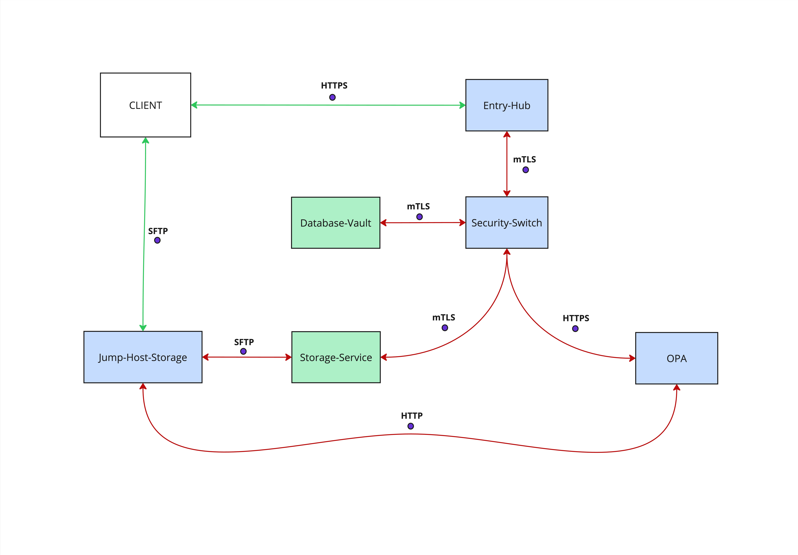

# Complete System Flow  
**Client → Entry-Hub → Security-Switch → Database-Vault**

1. Client sends HTTPS request to Entry-Hub  
2. Entry-Hub validates and forwards request via mTLS to Security-Switch  
3. Security-Switch validates (defense-in-depth) and forwards via mTLS to Database-Vault  
4. Database-Vault validates (defense-in-depth), encrypts, stores, and responds  
5. Response returns back:  
   `Database-Vault → Security-Switch → Entry-Hub → Client`

---

# Entry-Hub: Execution Flow

## STARTUP (`main.go`)

- **Load configuration:** HTTPS server certificates, mTLS client certs for Security-Switch  
- **Validate configuration:** check certificate files exist, validate cert/key pairs, test Security-Switch connectivity
- **Configure HTTPS server:** TLS server for external clients  
- **Configure mTLS client:** certificates for communicating with Security-Switch  
- **Start HTTPS server on port 8443:** accept TLS clients  

## CLIENT REQUEST HANDLING (`/api/register`)

- **Receive HTTPS request:** from external client (curl, app, etc.)  
- **Validate HTTP method:** accept **POST** only  
- **Read request body:** JSON with email, password, SSH key  
- **Parse JSON:** convert into `RegisterRequest` struct  

## ENTRY-LEVEL VALIDATION

- **Validate required fields:** email, password, SSH key present  
- **Validate email format:** RFC 5322 compliant  
- **Validate password length:** minimum 8 characters  
- **Check for weak passwords:** common password dictionary check  
- **Validate password complexity:** at least 3 character categories  
- **Validate SSH key format:** algorithm, encoding, wire format structure  

## FORWARD TO SECURITY-SWITCH

- **Initialize mTLS client:** certificates for Security-Switch  
- **Certificate validation:** verify Security-Switch certificate chain, check organization="SecuritySwitch"
- **Create mTLS request:** POST to Security-Switch `/api/register`  
- **Send via mTLS:** authenticated connection to Security-Switch  
- **Receive response:** success/error from Security-Switch  

## RESPONSE TO CLIENT

- **Log operation:** audit trail  
- **Forward response:** HTTP status + JSON message to original client  
- **Error handling:** HTTP 400 (validation), 401 (auth), 500 (internal), 502 (bad gateway), 503 (service unavailable)
- **Error categorization:** detailed logs vs sanitized client messages

---

# Security-Switch: Execution Flow

## STARTUP (`main.go`)

- **Load configuration:** mTLS server certificates, mTLS client certs for Database-Vault  
- **Validate configuration:** check certificate files exist, validate cert/key pairs.
- **Configure mTLS server:** accept only authenticated Entry-Hub connections  
- **Configure mTLS client:** certificates for communicating with Database-Vault  
- **Start mTLS server on port 8444:** certificate-only connections  

## ENTRY-HUB REQUEST HANDLING (`/api/register`)

- Verify mTLS: check Entry-Hub certificate (middleware)  
- **Certificate validation:** verify certificate chain, CA validation, check organization = "EntryHub"
- **Authentication logging:** log successful/failed authentication attempts with certificate details
- **Validate HTTP method:** accept **POST** only  
- **Read request body:** JSON with email, password, SSH key  
- **Parse JSON:** convert into `RegisterRequest` struct  

## DEFENSE-IN-DEPTH VALIDATION

- **Validate required fields:** email, password, SSH key present  
- **Validate email format:** RFC 5322 + security checks  
- **Validate password length:** minimum 8 characters  
- **Check for weak passwords:** common password dictionary check  
- **Validate password complexity:** at least 3 character categories  
- **Validate SSH key format:** algorithm, encoding, wire format structure  

## FORWARD TO DATABASE-VAULT

- **Initialize mTLS client:** certificates for Database-Vault  
- **Certificate validation:** verify Database-Vault certificate chain, check organization="DatabaseVault"
- **Create mTLS request:** POST to Database-Vault `/api/store-user`  
- **Send via mTLS:** authenticated connection to Database-Vault  
- **Receive response:** success/error from Database-Vault  

## RESPONSE TO ENTRY-HUB

- **Log operation:** audit trail  
- **Forward response:** HTTP status + JSON message to Entry-Hub  
- **Error handling:** HTTP 400 (validation), 401 (auth), 403 (forbidden), 500 (internal), 502 (bad gateway), 504 (gateway timeout)
- **Error categorization:** detailed internal logs vs sanitized upstream messages

---

# Database-Vault: Complete Execution Flow

## STARTUP (`main.go`)

- Load configuration: mTLS certificates, encryption key, database URL  
- **Validate configuration:** check certificate files exist, validate cert/key pairs
- **Validate encryption key:** check AES-256 key from environment variable  
- **Key validation:** ensure 32-byte length, entropy check, format verification
- **Mask database credentials in logs:** hide username/password, preserve host/port/database for debugging
- **Configure mTLS server:** certificates to accept only Security-Switch  
- **Start mTLS server on port 8445:** authenticated connections only  

## REQUEST HANDLING (`/api/store-user`)

- **Verify mTLS:** check Security-Switch certificate (middleware)  
- **Certificate validation:** verify certificate chain, CA validation, check organization="SecuritySwitch"
- **Authentication logging:** log successful/failed authentication attempts with certificate details
- **Validate HTTP method:** accept **POST** only  
- **Read request body:** JSON with email, password, SSH key  
- **Parse JSON:** convert into `RegisterRequest` struct  

## DEFENSE-IN-DEPTH VALIDATION

- **Validate required fields:** email, password, SSH key present  
- **Validate email format:** RFC 5322 compliant  
- **Validate password length:** minimum 8 characters  
- **Check for weak passwords:** common password dictionary check  
- **Validate password complexity:** at least 3 character categories  
- **Validate SSH key format:** algorithm, encoding, wire format structure  

## ENCRYPTION AND HASHING

- **Derive operation-specific keys:** use HKDF-SHA256 with master key
  - **Email encryption key:** 32 bytes, context "email-encryption-v1"
  - **Email nonce:** 12 bytes, context "email-nonce-v1"
- **Key derivation ensures:** deterministic encryption for consistent database lookup
- **Encrypt email:** AES-256-GCM deterministic encryption for DB lookup  
- **Email encryption process:** derived key + fixed nonce = same output for same email
- **Generate password salt:** 16 bytes cryptographically secure random  
- **Hash password:** Argon2id with generated salt  
- **Password hashing parameters:** 1 iteration, 32MB memory, 4 threads, 32-byte output

## STORAGE (when PostgreSQL implemented)

- **Check for duplicate email:** query with encrypted email  
- **Duplicate detection:** deterministic encryption enables exact match queries
- **Check for duplicate SSH key:** query with SSH public key  
- **Create user record:** encrypted email, password hash, salt, SSH key, timestamps  
- **User record structure:** encrypted_email (PK), password_hash, password_salt, ssh_public_key, created_at, updated_at
- **Save in database:** atomic transaction  
- **Storage transaction:** ensure complete user record creation or rollback

## RESPONSE

- **Log operation:** audit trail with timestamp  
- **Audit logging:** record user email (plaintext in logs only), operation success, timestamp
- **Send response:** HTTP 201 Created + JSON success message to Security-Switch  
- **Error handling:** HTTP 400 (validation), 401 (auth), 403 (forbidden), 409 (conflict), 500 (internal), 503 (database unavailable)
- **Error categorization:** detailed storage errors vs sanitized upstream messages

---

# Technical Implementation Details

## Certificate Organization Validation
- **Entry-Hub** accepts clients: any (external clients in the Tailscal private network)
- **Security-Switch** accepts clients: organization = `"EntryHub"` only
- **Database-Vault** accepts clients: organization = `"SecuritySwitch"` only

## Encryption Key Management
- **Master key source**: `RAMUSB_ENCRYPTION_KEY` environment variable (64 hex chars = 32 bytes)
- **Key derivation**: HKDF-SHA256 for operation-specific keys
- **Context strings**: prevent key reuse across different operations
- **Deterministic encryption**: enables database lookup with consistent results

## Error Response Hierarchy
- **HTTP 400**: validation errors (bad input)
- **HTTP 401**: authentication errors (missing/invalid certificates)  
- **HTTP 403**: authorization errors (wrong organization)
- **HTTP 409**: conflict errors (duplicate email/SSH key)
- **HTTP 500**: internal server errors
- **HTTP 502**: upstream service errors
- **HTTP 503**: service unavailable (database down)
- **HTTP 504**: upstream timeout errors

## Password Security
- **Hashing**: Argon2id (memory-hard, GPU-resistant)
- **Salt**: 16 bytes random per user
- **Parameters**: 1 iteration, 32MB memory, 4 threads
- **Weak password check**: dictionary-based validation
- **Complexity**: minimum 3 of 4 character categories

## SSH Key Validation
- **Supported algorithms**: ssh-rsa, ssh-ed25519, ecdsa-sha2-nistp256/384/521
- **Wire format validation**: algorithm consistency, base64 structure, length validation
- **Security**: prevent malformed keys, algorithm substitution attacks